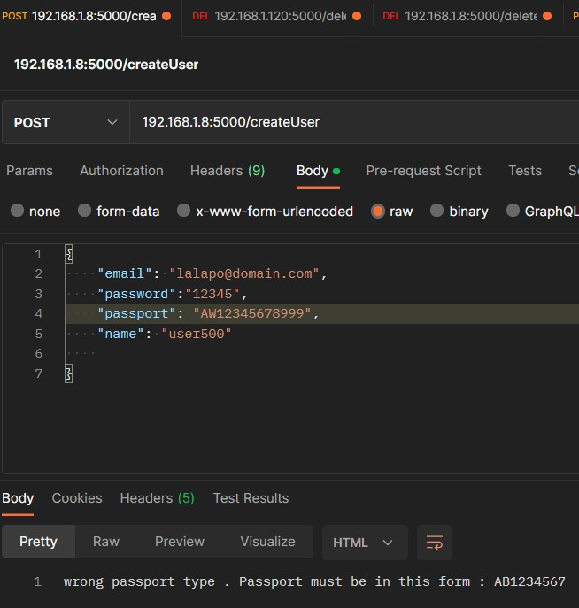
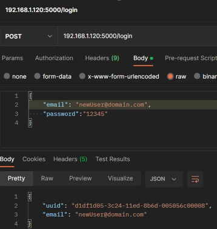
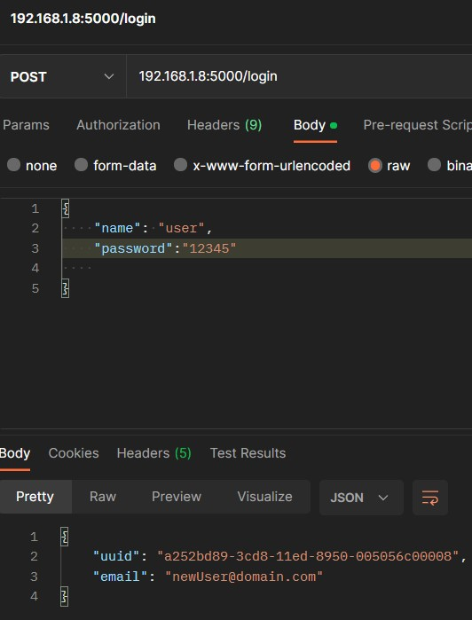
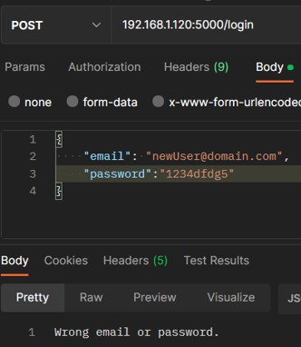
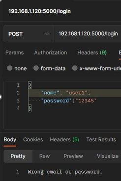

# YpoxreotikiErgasiaSept2022_E17049_Zarkali_Vasilo

## Χρήσιμα Εργαλεία

Τα εργαλεία που θα χρησιμοποιήσουμε την υλοποίηση της εργασίας είναι τα εξής:

•Visual Studio Code: ο editor που θα προτιμήσουμε για την σύνταξη του python κώδικα.  
•Postman: η πλατφόρμα που θα χρησιμοποιήσουμε για την ανάπτυξη του API.  
•MongoDBCompass: το GUI που θα μας επιτρέψει να βλέπουμε τι συμβαίνει στη βάση δεδομένων κάθε στιγμή.  
•Virtual Box: το περιβάλλον που θα χρησιμοποιήσουμε για την εγκατάσταση του ubuntu.  
•Ubuntu: το λογισμικό που θα υποστηρίξει την υλοποίηση image, docker compose.  
Αρχικά, θα κάνουμε import  το JSON αρχείο στη MongoDBCompass ώστε να υπάρχει σύνδεση με τη βάση δεδομένων.
## Ερώτημα 1: createUser/User 
Υλοποιώντας κλήση της μεθόδου Post, το ανάλογο path και την εισαγωγή σε json μορφή των απαιτούμενων στοιχείων, ο χρήστης μπορεί να στείλει αίτημα για την εγγραφή του στο σύστημα.  

Υστερα πραγματοποιείται έλεγχος αν έχουν δοθεί τα απαιτούμενα δεδομένα, αν η json μορφή είναι η κατάλληλη και αν τηρούνται οι περιορισμοί που έχουν διατυπωθεί. Εφόσον ισχύουν αυτά, η εγγραφή στο σύστημα είναι επιτυχής και πραγματοποιείται καταχώρηση των στοιχείων στη βάση δεδομένων, στην αντίθετη περίπτωση εμφανίζεται το ανάλογο μήνυμα.  

### Επιτυχημένη Εγγραφή - Postman  
  

### Επιτυχημένη Εγγραφή - Mongo   
  

### Αποτυχημένη Εγγραφή (failure = existing name) - Postman
  

### Αποτυχημένη Εγγραφή (failure = existing passport) - Postman  
  

### Αποτυχημένη Εγγραφή (failure = passport form) - Postman     
   

## Ερώτημα 2: Login/User  
Δίνοντας ως input ένα email ή ένα username και τον ανάλογο κωδικό, θα υλοποιηθεί ένας έλεγχος εγκυρότητας των στοιχείων μέσα στη βάση δεδομένων. Εάν υπάρξει ταυτοποίηση, το Postman επιστρέφει ως response το email δώθηκε και ένα uuid, μία μεταβλητή που θα που θα αλλάζει μετά από κάθε login session, η οποία θα μας φανεί χρήσιμη για την υλοποίηση των ακόλουθων ερωτημάτων.  

### Επιτυχημένo Login (email) - Postman  
  

### Επιτυχημένo Login (name) - Postman   
    

### Αποτυχημένο Login (failure = wrong password) - Postman  
    

### Αποτυχημένο Login (failure = wrong name) - Postman  
  

