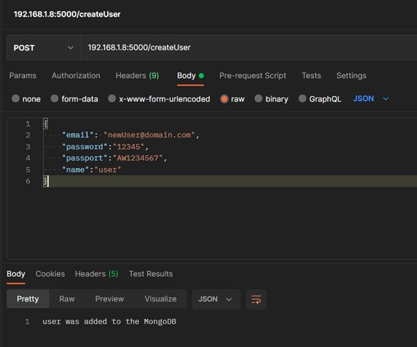
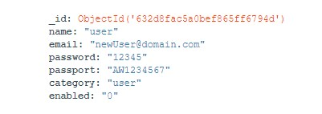
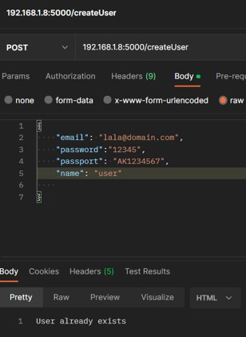
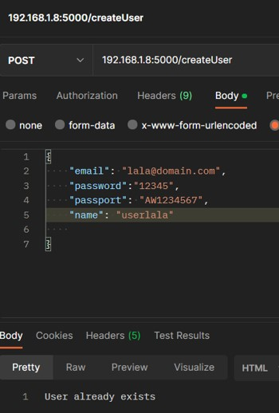

# YpoxreotikiErgasiaSept2022_E17049_Zarkali_Vasilo

## Χρήσιμα Εργαλεία

Τα εργαλεία που θα χρησιμοποιήσουμε την υλοποίηση της εργασίας είναι τα εξής:

•Visual Studio Code: ο editor που θα προτιμήσουμε για την σύνταξη του python κώδικα.  
•Postman: η πλατφόρμα που θα χρησιμοποιήσουμε για την ανάπτυξη του API.  
•MongoDBCompass: το GUI που θα μας επιτρέψει να βλέπουμε τι συμβαίνει στη βάση δεδομένων κάθε στιγμή.  
•Virtual Box: το περιβάλλον που θα χρησιμοποιήσουμε για την εγκατάσταση του ubuntu.  
•Ubuntu: το λογισμικό που θα υποστηρίξει την υλοποίηση image, docker compose.  
Αρχικά, θα κάνουμε import  το JSON αρχείο στη MongoDBCompass ώστε να υπάρχει σύνδεση με τη βάση δεδομένων.
## Ερώτημα 1: createUser/User
Απαιτείται ο χρήστης να έχει τη δυνατότητα να κάνει εγγραφή στο σύστημα, δίνοντας ως input τα ακόλουθα:  
• email  
• username  
• name  
• password (Τουλάχιστον 8 χαρακτήρες εκ των οποίων ο 1 να είναι αριθμός)  
• passport (2 χαρακτήρες ακολουθούμενους από 7 ψηφία)

Ένας νέος χρήστης μπορεί να κάνει εγγραφή αν δεν υπάρχει ήδη άλλος χρήστης με το ίδιο email, username, passport.  

Υλοποιώντας κλήση της μεθόδου Post, το ανάλογο path και την εισαγωγή σε json μορφή των απαιτούμενων στοιχείων, ο χρήστης μπορεί να στείλει αίτημα για την εγγραφή του στο σύστημα.  

Υστερα πραγματοποιείται έλεγχος αν έχουν δοθεί τα απαιτούμενα δεδομένα, αν η json μορφή είναι η κατάλληλη και αν τηρούνται οι περιορισμοί που έχουν διατυπωθεί. Εφόσον ισχύουν αυτά, η εγγραφή στο σύστημα είναι επιτυχής, στη αντίθετη περίπτωση εμφανίζεται το ανάλογο μήνυμα.  

### Επιτυχημένη Εγγραφή - Postman  
  

### Επιτυχημένη Εγγραφή - Mongo   
  

### Αποτυχημένη Εγγραφή (failure=name) - Postman
  

### Αποτυχημένη Εγγραφή (failure=passport) - Postman  
  

